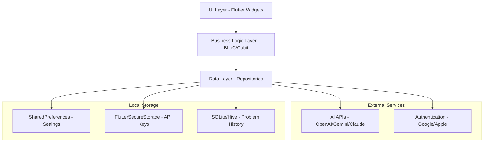

# Design Document

## Overview

ScrollLearn AI is architected as a Flutter-based cross-platform mobile application that leverages gesture recognition, AI API integration, and local data management to deliver an interactive learning experience. The design emphasizes modularity, performance, and user experience through a clean separation of concerns and efficient state management.

## Architecture

### High-Level Architecture



### Layer Responsibilities

- **UI Layer**: Flutter widgets, gesture detection, animations, and user interactions
- **Business Logic Layer**: State management using BLoC pattern, business rules, and data transformation
- **Data Layer**: Repository pattern for data access, API clients, and local storage management

## Components and Interfaces

### Core Components

#### 1. Gesture Recognition System
```dart
abstract class GestureHandler {
  Stream<SubjectType> get gestureStream;
  void handlePanUpdate(DragUpdateDetails details);
  void handlePanEnd(DragEndDetails details);
}

class SwipeGestureHandler implements GestureHandler {
  static const double minSwipeDistance = 100.0;
  static const double maxSwipeAngle = 30.0; // degrees from horizontal/vertical
}
```

#### 2. AI Integration Layer
```dart
abstract class AIProvider {
  Future<Problem> generateProblem(SubjectType subject, DifficultyLevel difficulty);
  String get providerName;
  bool get requiresApiKey;
}

class OpenRouterClient implements AIProvider {
  final String apiKey;
  final String baseUrl = 'https://openrouter.ai/api/v1';
}
```

#### 3. Problem Management
```dart
class Problem {
  final String id;
  final SubjectType subject;
  final String question;
  final List<String>? multipleChoiceOptions;
  final String correctAnswer;
  final String explanation;
  final DifficultyLevel difficulty;
  final DateTime createdAt;
}

abstract class ProblemRepository {
  Future<Problem> generateProblem(SubjectType subject, DifficultyLevel difficulty);
  Future<void> saveProblemAttempt(ProblemAttempt attempt);
  Stream<List<Problem>> getProblemHistory();
}
```

#### 4. Settings Management
```dart
class AppSettings {
  final Set<SubjectType> enabledSubjects;
  final ThemeMode themeMode;
  final DifficultyLevel defaultDifficulty;
  final String? selectedAIProvider;
  final Map<String, String> apiKeys;
}

abstract class SettingsRepository {
  Future<AppSettings> getSettings();
  Future<void> updateSettings(AppSettings settings);
  Future<void> setApiKey(String provider, String key);
}
```

### State Management Architecture

#### BLoC Structure
```dart
// Main App State
class AppBloc extends Bloc<AppEvent, AppState> {
  final SettingsRepository settingsRepository;
  final AuthRepository authRepository;
}

// Problem Generation State
class ProblemBloc extends Bloc<ProblemEvent, ProblemState> {
  final ProblemRepository problemRepository;
  final SettingsRepository settingsRepository;
}

// Gesture Handling State
class GestureBloc extends Bloc<GestureEvent, GestureState> {
  final GestureHandler gestureHandler;
}
```

## Data Models

### Core Entities

#### Subject Types
```dart
enum SubjectType {
  math('Math', Icons.calculate),
  science('Science', Icons.science),
  history('History', Icons.history_edu),
  geography('Geography', Icons.public);
  
  const SubjectType(this.displayName, this.icon);
  final String displayName;
  final IconData icon;
}
```

#### Gesture Direction Mapping
```dart
enum GestureDirection {
  up(SubjectType.science),
  down(SubjectType.math),
  left(SubjectType.geography),
  right(SubjectType.history);
  
  const GestureDirection(this.subject);
  final SubjectType subject;
}
```

#### Problem Attempt Tracking
```dart
class ProblemAttempt {
  final String problemId;
  final String userAnswer;
  final bool isCorrect;
  final DateTime attemptedAt;
  final Duration timeSpent;
}
```

### Data Storage Strategy

#### Local Storage Distribution
- **SharedPreferences**: User preferences, theme settings, enabled subjects
- **FlutterSecureStorage**: API keys, authentication tokens
- **SQLite/Hive**: Problem history, attempt records, offline cache

#### Data Synchronization
- Settings changes trigger immediate local persistence
- Problem attempts are batched and stored locally
- Optional cloud sync for authenticated users (future enhancement)

## Error Handling

### Error Categories and Responses

#### Network Errors
```dart
class NetworkErrorHandler {
  static const int maxRetries = 3;
  static const Duration retryDelay = Duration(seconds: 2);
  
  Future<T> executeWithRetry<T>(Future<T> Function() operation) async {
    // Exponential backoff retry logic
  }
}
```

#### API Key Validation
```dart
class APIKeyValidator {
  static Future<bool> validateOpenAIKey(String key) async {
    // Test API call with minimal usage
  }
  
  static Future<bool> validateGeminiKey(String key) async {
    // Provider-specific validation
  }
}
```

#### Gesture Recognition Errors
- Invalid gesture patterns fallback to neutral state
- Gesture conflicts resolved by velocity and distance thresholds
- Accessibility support for users with motor difficulties

### User-Facing Error Messages
- Network connectivity issues: "Check your internet connection and try again"
- Invalid API key: "Please verify your API key in settings"
- Problem generation failure: "Unable to generate problem. Try a different subject"
- Gesture recognition issues: "Swipe gesture not recognized. Try again"

## Testing Strategy

### Unit Testing
- **Model Classes**: Data validation, serialization/deserialization
- **Repository Layer**: Mock API responses, local storage operations
- **Business Logic**: BLoC state transitions, business rule validation
- **Utility Functions**: Gesture calculation algorithms, API key validation

### Widget Testing
- **Gesture Recognition**: Simulate swipe gestures and verify subject selection
- **Problem Display**: Test problem rendering with different content types
- **Settings UI**: Verify form validation and state updates
- **Navigation Flow**: Test onboarding sequence and main app navigation

### Integration Testing
- **End-to-End Flows**: Complete user journey from onboarding to problem solving
- **API Integration**: Test with real API endpoints using test keys
- **Cross-Platform**: Verify consistent behavior on Android and iOS
- **Performance**: Measure gesture response times and API call latency

### Testing Tools and Frameworks
```dart
// Unit Testing
import 'package:flutter_test/flutter_test.dart';
import 'package:mockito/mockito.dart';
import 'package:bloc_test/bloc_test.dart';

// Integration Testing
import 'package:integration_test/integration_test.dart';

// Performance Testing
import 'package:flutter_driver/flutter_driver.dart';
```

### Test Coverage Goals
- Unit Tests: 90% code coverage
- Widget Tests: All critical user interactions
- Integration Tests: Primary user flows
- Performance Tests: Gesture response < 200ms, API calls < 3s

## Performance Considerations

### Gesture Recognition Optimization
- Debounce rapid gesture inputs to prevent multiple API calls
- Use gesture velocity thresholds to distinguish intentional swipes
- Implement gesture prediction for smoother user experience

### API Call Management
- Cache recent problems to reduce API usage
- Implement request queuing for rapid gesture sequences
- Use connection pooling for HTTP clients
- Implement circuit breaker pattern for failing APIs

### Memory Management
- Lazy loading of problem history
- Image caching for visual problems
- Dispose of unused BLoC instances
- Optimize widget rebuilds with const constructors

### Battery Optimization
- Minimize background processing
- Use efficient gesture detection algorithms
- Implement smart refresh strategies
- Optimize network usage patterns